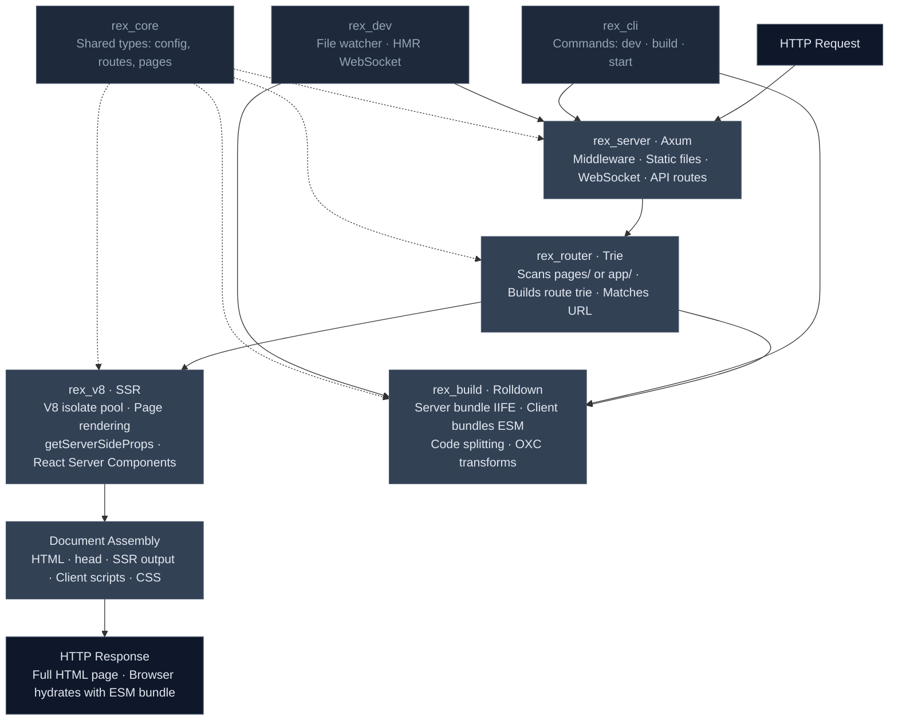

# Architecture

Rex is a Rust-native React framework. The server, router, build pipeline, and SSR engine are all written in Rust, while your application code remains standard React (TSX/JSX). Read more about [why we built Rex](/architecture/motivations).

## Overview



## How a request flows

1. **Axum** receives the HTTP request
2. **Router** matches the URL against the file-system route trie
3. **V8 isolate** renders the matched page to HTML (SSR)
4. **Document assembly** wraps the HTML with `<head>`, client scripts, and CSS
5. **Response** is sent — the client hydrates with the ESM bundle

## Crate structure

Rex is organized as a Rust workspace with focused crates:

| Crate | Purpose |
|-------|---------|
| `rex_core` | Shared types — config, routes, page types |
| `rex_router` | File-system scanner + trie-based route matcher |
| `rex_build` | Rolldown bundler for server and client bundles |
| `rex_v8` | V8 isolate pool and SSR engine |
| `rex_server` | Axum HTTP server, handlers, document assembly |
| `rex_dev` | File watcher (notify) + HMR WebSocket |
| `rex_cli` | CLI entry point — `dev`, `build`, `start` commands |

## Key technologies

### Rolldown (bundler)

Rex uses [Rolldown](https://rolldown.rs) for both server and client bundling:

- **Server bundle** — single IIFE output that runs in bare V8. All pages and React are bundled together.
- **Client bundles** — ESM output with code splitting. React becomes a shared chunk, and each page gets its own chunk for lazy loading.

### OXC (parser)

[OXC](https://oxc.rs) handles TSX/JSX parsing and TypeScript stripping. It's integrated through Rolldown and provides fast, spec-compliant transforms without needing SWC or Babel.

### V8 (SSR)

Server-side rendering runs in V8 isolates — the same JavaScript engine that powers Chrome. Each isolate runs on a dedicated OS thread. Polyfills for `setTimeout`, `TextEncoder`, `MessageChannel`, and other APIs are injected automatically.

There's no Node.js runtime involved in SSR. This means faster startup, lower memory, and a smaller attack surface.

### Axum (HTTP server)

The HTTP layer uses [Axum](https://github.com/tokio-rs/axum), a Rust web framework built on Tokio. It handles routing, static file serving, WebSocket (for HMR), and middleware.

## Build output

Running `rex build` produces:

```
.rex/build/
  manifest.json          # Route map, build ID, data strategies
  server/
    server-bundle.js     # Single IIFE for V8 SSR
  client/
    index-[hash].js      # Per-page ESM chunks
    about-[hash].js
    shared-[hash].js     # Shared React chunk
    styles/
      globals.css        # Extracted CSS
```

The **manifest** tracks which routes exist, their data-fetching strategy (none, `getServerSideProps`, or `getStaticProps`), and the mapping from routes to client-side JS chunks.
